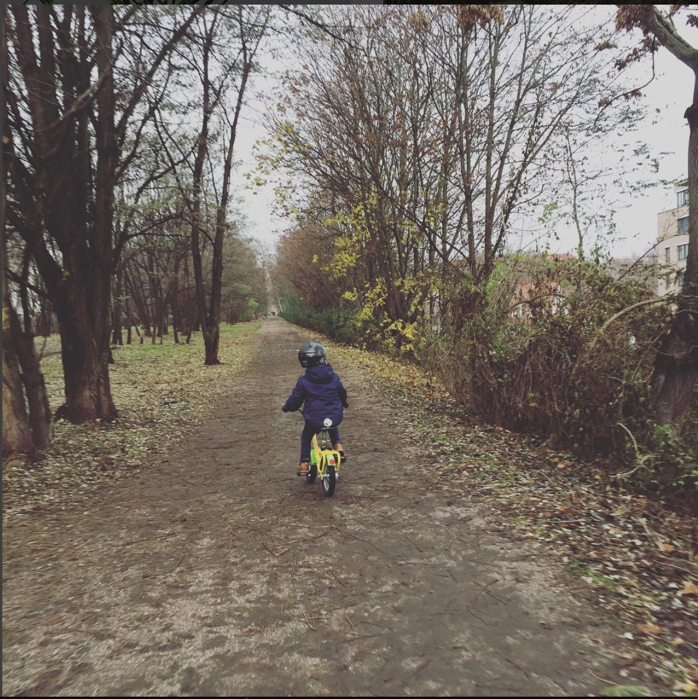

# Learning github and markdown

Today we are learning ....

## List

### Order List

1. Bananas
2. Raspberries
3. Bread

### Unorder List

- Noodles
- Cheese
- Avocado

## Link to a page
[Spiced Academy](https://www.spiced-academy.com/de)

>Learn to code

## Image


## uploaded image



## Code
### Code line

We can add a code line 'console.log(almostDone)'

### Code Block

'''js
const cohort = "chervil"
const student = {
"firstName": "John",
  "lastName": "Smith",
  "age": 25
}
```


